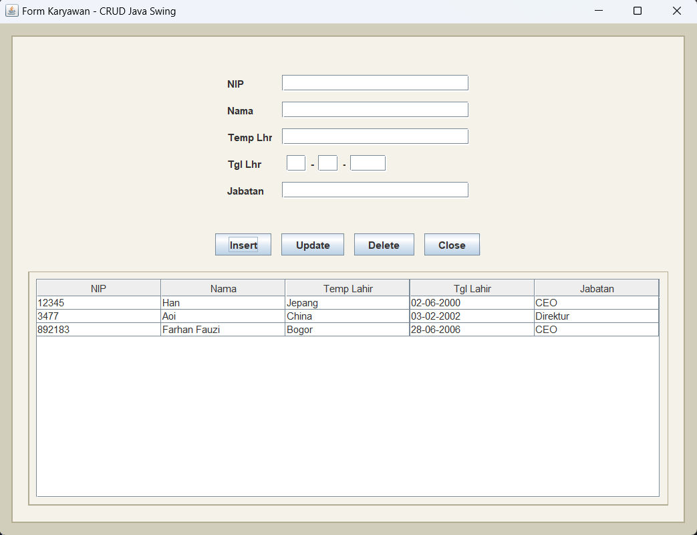

# DatabaseJava-FarhanFauzi-I.2510513

### Penjelasan Tugas Praktikum Java Database

Tugas ini adalah tugas untuk membuat aplikasi sederhana menggunakan Java yang terhubung dengan database MySQL melalui XAMPP. Aplikasi ini dirancang untuk menampilkan dan mengelola data menggunakan form input sederhana.


#### Cara Menjalankan Program:
1. Pastikan XAMPP sudah berjalan dan MySQL aktif.
2. Buat database di MySQL sesuai dengan konfigurasi yang ada di file `CConnection.java`.
3. Jalankan perintah berikut di terminal (CMD) untuk menjalankan aplikasi:
   ```bash
   mvn compile exec:java
   ```

#### Hasil Program:
Program ini menghasilkan form input sederhana yang memungkinkan pengguna untuk:
- Menambahkan data karyawan.
- Menampilkan data karyawan yang tersimpan di database.

Berikut adalah hasil tampilan program:



#### Catatan:
- Pastikan dependensi Maven sudah terinstal dengan benar.
- Saat saya mengejakan project ini karna saya memakai xampp sebagai database mysqlnya pastikan path C:\xampp\mysql\bin masuk ke Environment Variables agar tidak ada eror

